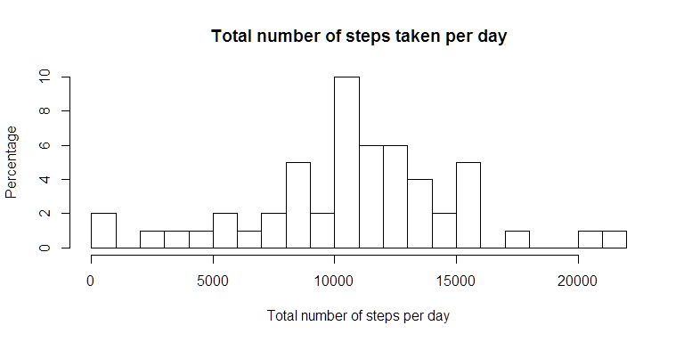
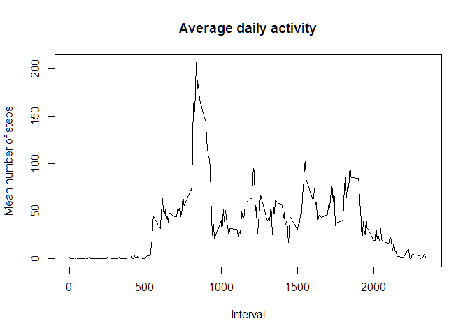
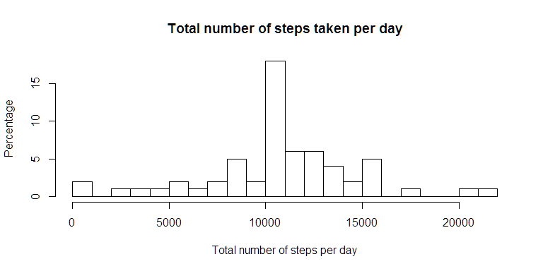
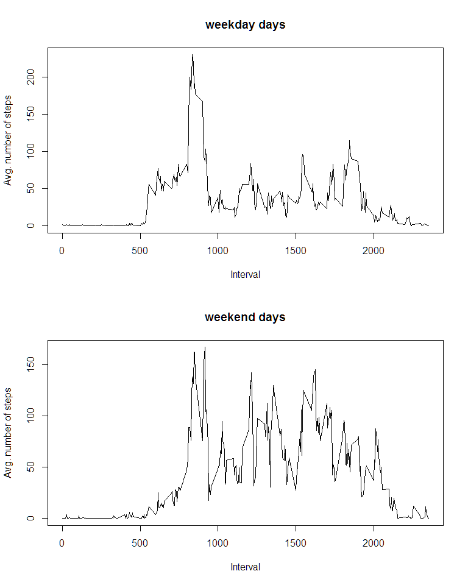

# Reproducible Research: Peer Assessment 1


## Introduction

This assignment makes use of data from a personal activity monitoring device. 
This device collects data at 5 minute intervals through out the day
(eg. interval 1455 means 14:55 o'clock until 15:00 o'clock (24h time)).
The data consists of two months of data from an anonymous individual collected 
during the months of October and November, 2012 and include the number of steps 
taken in 5 minute intervals each day.

Dataset:
https://d396qusza40orc.cloudfront.net/repdata/data/activity.zip


## Loading and preprocessing the data

```r
if (!file.exists("./activity.csv")) {
    unzip(zipfile="./activity.zip") # needs only to be unzipped once
}
data <- read.csv(file="./activity.csv")
str(data)
```

```
## 'data.frame':	17568 obs. of  3 variables:
##  $ steps   : int  NA NA NA NA NA NA NA NA NA NA ...
##  $ date    : Factor w/ 61 levels "2012-10-01","2012-10-02",..: 1 1 1 1 1 1 1 1 1 1 ...
##  $ interval: int  0 5 10 15 20 25 30 35 40 45 ...
```
Columns 'steps' and 'interval' have format 'int', which we can work on.
The format of the column 'date' is 'factor' and should be 'date'.

Transforming format of column 'date' from 'factor' to 'date'

```r
data$date <- as.Date(data$date)
summary(data)
```

```
##      steps             date               interval     
##  Min.   :  0.00   Min.   :2012-10-01   Min.   :   0.0  
##  1st Qu.:  0.00   1st Qu.:2012-10-16   1st Qu.: 588.8  
##  Median :  0.00   Median :2012-10-31   Median :1177.5  
##  Mean   : 37.38   Mean   :2012-10-31   Mean   :1177.5  
##  3rd Qu.: 12.00   3rd Qu.:2012-11-15   3rd Qu.:1766.2  
##  Max.   :806.00   Max.   :2012-11-30   Max.   :2355.0  
##  NA's   :2304
```


## What is mean total number of steps taken per day?

#### Total number of steps taken per day

```r
total_steps_per_day <- tapply(data$steps, data$date, sum)
summary(total_steps_per_day)
```

```
##    Min. 1st Qu.  Median    Mean 3rd Qu.    Max.    NA's 
##      41    8841   10760   10770   13290   21190       8
```
The total number of steps per day varies between 41 and 21190.
At 8 days no steps were recorded (NA values).

#### Histogram of the total number of steps taken each day

```r
hist(total_steps_per_day, breaks=20, xlab="Total number of steps per day", ylab="Percentage",
     main="Total number of steps taken per day")
```

 


#### The mean and median number of steps taken per day

```r
mean_steps_per_day <- mean(total_steps_per_day, na.rm=TRUE)
median_steps_per_day <- median(total_steps_per_day, na.rm=TRUE)
```
The mean is 10766.19 
and the median is 10765.

The mean and median have about the same value. 
The distribution is fairly symmetric and not skewed.


## What is the average daily activity pattern?

#### Average of number of steps in each 5 minute interval over all days

```r
avg_steps_per_interval <- tapply(data$steps, data$interval, mean, na.rm=TRUE)
intervals <- sort(unique(data$interval))
```

#### Time-series plot 

The following figure shows the time-series plot of the 5-minute interval (x-axis) 
and the average number of steps taken, averaged across all days (y-axis).

```r
plot(intervals, avg_steps_per_interval, type="l", xlab="Interval", ylab="Mean number of steps",
     main="Average daily activity")
```

 

#### Most active interval


```r
mostActiveInterval <- intervals[which.max(avg_steps_per_interval)]
```
The interval 835 contains the maximum number of steps on average.
It is the interval from 8:35 to 8:40 o'clock in the morning.


## Imputing missing values


```r
sumNA <- sum(is.na(data$steps))
```
The total number of missing values is 2304.

A common approach is to fill missing values with the average of non-missing values of that interval.


```r
# create a new dataset - initalize
dataNew <- data
# loop over all rows
for (i in 1:nrow(data)) {
    # if column steps contains NA
    if (is.na(data$steps[i])) {
        # replace NA with the mean of all non-NA values of the same interval
        dataNew$steps[i] <- mean(data$steps[data$interval == data$interval[i]], na.rm=TRUE)
    }
}
```

#### Histogram of the total number of steps taken each day


```r
total_steps_per_dayNew <- tapply(dataNew$steps, dataNew$date, sum)

hist(total_steps_per_dayNew, breaks=20, xlab="Total number of steps per day", ylab="Percentage",
     main="Total number of steps taken per day")
```

 
```

#### The mean and median number of steps taken per day

```r
mean_steps_per_dayNew <- mean(total_steps_per_dayNew)
median_steps_per_dayNew <- median(total_steps_per_dayNew)
```
The mean is 10766.19 
and the median is 10766.19.

Mean and median are the same. 
The mean is the same as without the imputed values, but the median has changed.
When imputing missing values ... ???


## Are there differences in activity patterns between weekdays and weekends?

We first need to calculate whether a specific data is on a weekday or on a weekend.

```r
# set local time 
Sys.setlocale("LC_TIME", "English")
```

```
## [1] "English_United States.1252"
```

```r
# create a new factor variable weekend
wd <- weekdays(as.Date(data$date))
dataNew$weekend <- FALSE
dataNew$weekend <- (wd == "Saturday" | wd == "Sunday")
dataNew$weekend <- as.factor(dataNew$weekend)

weekend_mean <- tapply(dataNew$steps[dataNew$weekend==TRUE], dataNew$interval[dataNew$weekend==TRUE], mean)
weekday_mean <- tapply(dataNew$steps[dataNew$weekend==FALSE], dataNew$interval[dataNew$weekend==FALSE], mean)

par(mfrow=c(2,1))
plot(intervals, weekday_mean, type="l", xlab="Interval", ylab="Avg. number of steps", main="weekday days")
plot(intervals, weekend_mean, type="l", xlab="Interval", ylab="Avg. number of steps", main="weekend days")
```

 

```r
par(mfrow=c(1,1))
```

As one can cleary recognize, on weekdays the most active time is in the morning 
from about 5:30 o'clock to 10:00 o'clock.
At the weekend the active time starts later, but is more spread out from about 
8:00 o'clock in the morning to 20:00 o'clock in the evening.


